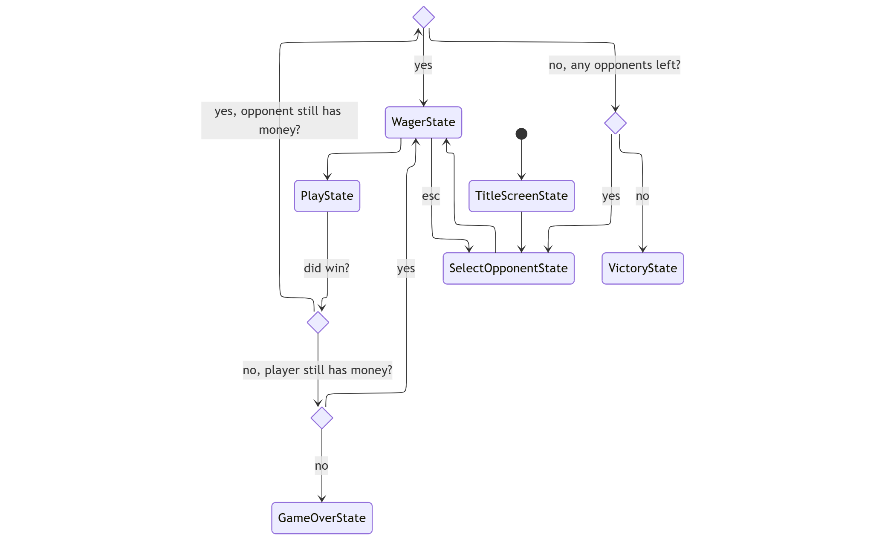
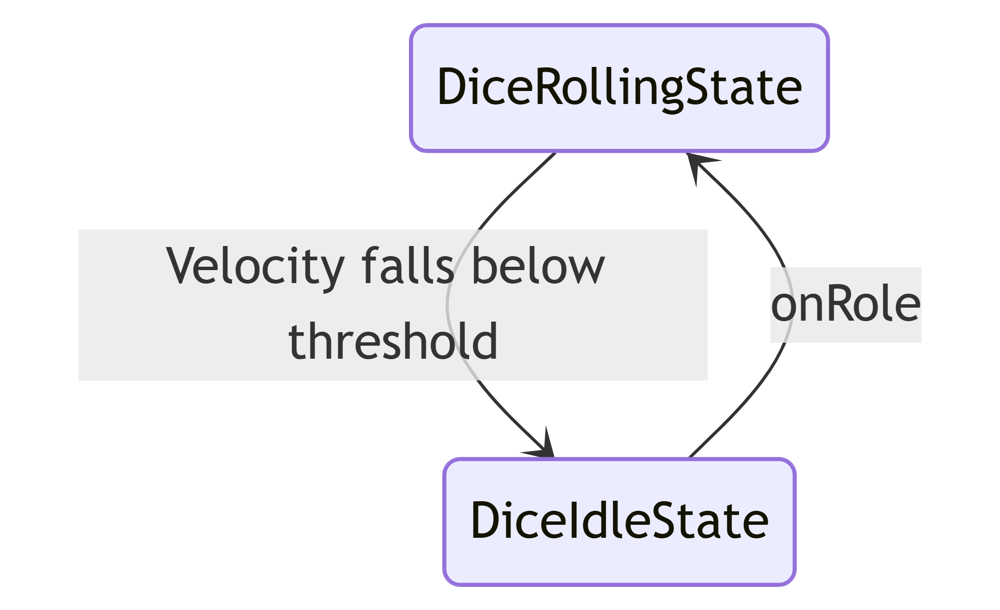
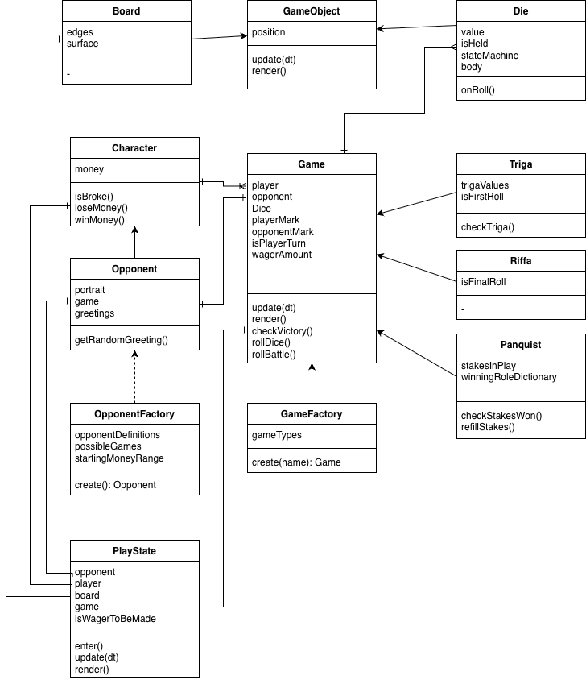
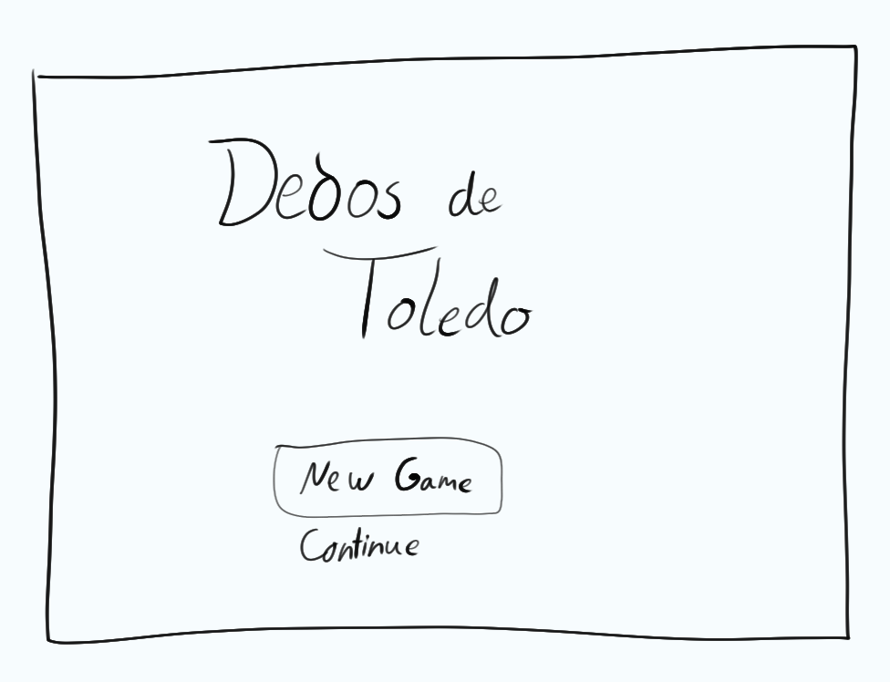
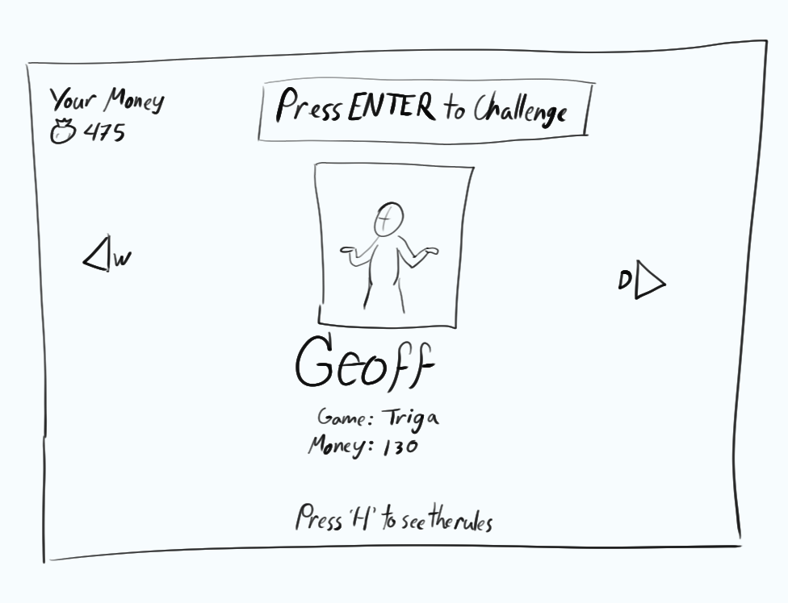
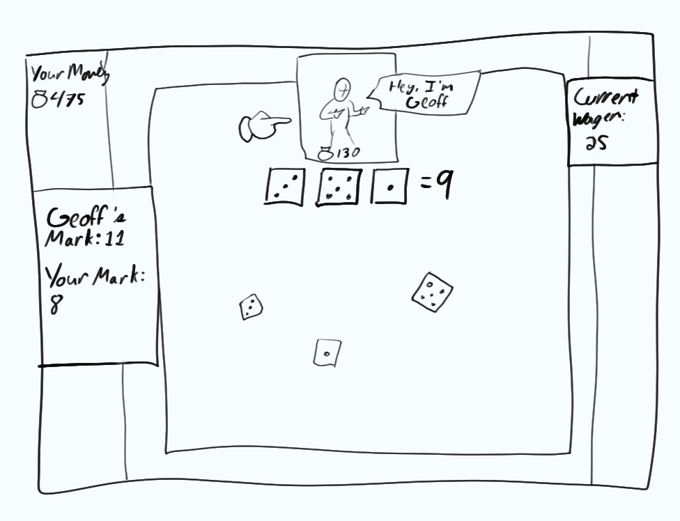
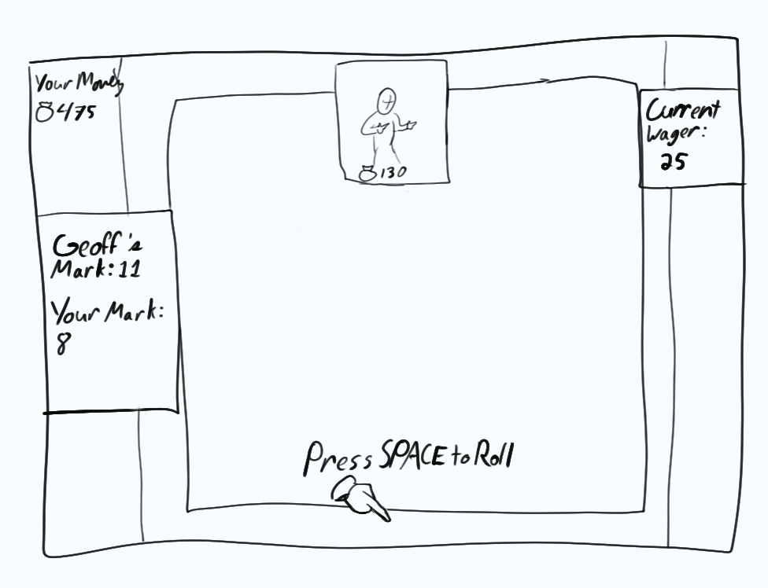

# Final Project

-   [ ] Read the [project requirements](https://vikramsinghmtl.github.io/420-5P6-Game-Programming/project/requirements).
-   [ ] Replace the sample proposal below with the one for your game idea.
-   [ ] Get the proposal greenlit by Vik.
-   [ ] Place any assets in `assets/` and remember to update `src/config.json`.
-   [ ] Decide on a height and width inside `src/globals.js`. The height and width will most likely be determined based on the size of the assets you find.
-   [ ] Start building the individual components of your game, constantly referring to the proposal you wrote to keep yourself on track.
-   [ ] Good luck, you got this!

---

# 🎲 Dados de Toledo

## ✒️ Description

This game is inspired be real dice games described in the 13th century Spanish work by king Alfonso X of Castile, *Libro de los juegos* (Book of Games) or *Libro de axedrez, dados e tablas* (Book of Chess, Dice, and Tables).  
In this game, the player will be able to select from a number of opponents, each of whom has their own preferred dice game. Each of these games allows the player to wager a certain amount of their money, with the ultimate objective being to win all of the money from each opponent. Once each opponent runs out of money, they will no longer be able to play, and the player will have to move on to another opponent.  
There will be three games that opponents could favour: Riffa, Panquist, and Triga. Each of these games have their own set of rules for determining the winner and loser of the match.

## 🕹️ Gameplay

The Player starts by selecting their opponent, which will determine what game is being played. Each game starts with a wager phase where the player chooses how much money they are going to gamble on that round, with the amount not being able to exceed either their own or their opponent's total money. Once the wager has been placed, a "battle" roll is made by each player to determine who goes first.

From here the rules go according to the game being played.  
**Riffa:** This is the simplest game. Each player has 3 dice and they roll them until they get a pair on 2 of the dice. They then roll the third die one last time and add up the dice total. Whoever has the higher total wins the round's wager.  

**Triga:** Each player has 3 dice. On the first round, the player/opponent rolls their dice and adds up the values. If the total is below 7 or above 14, this is the Triga, and they win immediately. If the total is any value from 7 to 14, this value becomes their mark. The next player then rolls and does the same, winning on a Triga or getting a mark. If, however, a player rolls the other player's mark, the other player whose mark it is wins. Once each player has a mark, both players take turns rolling (with no more chances of winning on a Triga). From here, if a player rolls their own mark they win, but if they roll the opponent's mark, they lose.  

**Panquist:** Each player has 3 dice. Each player rolls until they get a value between 7 and 14 (inclusive) which becomes their mark. The players then keep rolling until they hit their own mark, in which case they win, or their opponent's mark, in which case they lose. How much is won is based on the precise values of each die when the mark is reached, with the winner getting either a quarter, half, two thirds, or all of the wager (the last being called a Panquist). The possible wins are as follows:  
| Mark Total | 1/4            | 1/2            | 3/4            | Panquist |
|------------|----------------|----------------|----------------|----------|
| 7          | n/a            | 5+1+1 or 4+2+1 | 2+2+3          | 3+3+1    |
| 8          | 5+2+1          | 4+3+1          | 6+1+1 or 2+2+4 | 3+3+2    |
| 9          | 6+2+1 or 5+3+1 | 4+3+2          | 2+2+5 or 3+3+3 | 4+4+1    |
| 10         | 5+4+1 or 5+3+2 | 6+3+1          | 2+2+6 or 4+3+3 | 4+4+2    |
| 11         | 6+3+2 or 5+4+2 | 6+4+1          | 5+5+1 or 4+4+3 | 3+3+5    |
| 12         | 6+5+1 or 6+4+2 | 5+4+3          | 5+5+2 or 4+4+4 | 3+3+6    |
| 13         | 6+5+2          | 6+4+3          | 6+6+1 or 5+5+3 | 4+4+5    |
| 14         | n/a            | 6+5+3          | 6+6+2 or 5+5+4 | 4+4+6    |

This is a single player game versus an AI opponent. The player can press 'H' at any time during the game to review the rules in case they are confused. Once the player has made a wager, they have to see the round through, but during the wager phase, they can decide to leave and challenge a different opponent to a different game if they so desire.

## 📃 Requirements

1. The user shall be able to switch between opponents using 'A' and 'D' on the opponent selection screen.
2. The user shall be able to select their desired opponent by pressing 'Enter'
3. The user shall be able to view the rules for the opponent's preferred game by pressing 'H' on the opponent selection screen or anytime in the PlayState.
4. The user shall choose how much money to wager when the game begins.
5. The user and opponent shall each roll a "battle" roll to determine who goes first.
6. The user and opponent shall roll their dice according to the rules of the game they are playing:

7. **Riffa**  
7-a. In **Riffa**, the user or ai opponent will roll their dice until they have a pair.  
7-b. The roller will then roll their last die once more and add up all the value.  
7-c. The second player will then do the same.  
7-d. The system will compare the totals and award the wager amount to whoever has the higher roll. In the case of a tie, no-one wins.

8. **Triga**  
8-a. In **Triga**, the user or ai opponent will roll their dice.  
8-b. The system will determine if the role is a Triga (below 7 or above 14), in which case the roller wins, or if the value will become the player's mark.  
8-c. The next player then rolls their dice.  
8-d. The system will determine if the role is a Triga, in which case the roller wins, the other player's mark, in which case the other player wins, or if the value will become the second player's mark.  
8-e. The players shall take turns rolling their dice.  
8-f. on each roll, the system shall determine whether the roll matches the roller's mark, in which case they win, or the other player's mark, in which case the other player wins, or whether the game shall keep going, in which case the the other player becomes the roller.  
8-g. When a winner is determined, the system will award the wager amount to the victor.

9. **Panquist**  
9-a. In **Panquist**, the user or ai opponent will roll their dice.  
9-b. The system determines whether the rolled value is between 7 and 14 (inclusive). If this is the case the system makes this the player's mark, otherwise the player rerolls until they get such a value.  
9-c. The second to roll then rolls until they get a value between 7 and 14 (inclusive), following the same logic as before.  
9-d. The system determines if their roll matches the other player's mark. If that is the case, the other player wins, otherwise the value becomes the second player's mark.  
9-e. Each player shall then take turns rolling their dice.  
9-f. On each role, the system shall determine if the roll matches the roller's mark, in which case they win, or the other player's mark, in which case the other player wins, or whether the game shall keep going, in which case the the other player becomes the roller. 
8-g. When a winner is determined, the system will determine what fraction of the wager to award to the winner based on the combination of dice which totalled to equal the mark. The system then awards that value to the victor.

10. The system shall determine whether the user or opponent has enough money to keep playing.
11. If they both still have money, the user shall return to the wager state from which they can enter a new wager or return to opponent selection.
12. If the ai opponent has no more money, the user shall return to the opponent selection.
13. If all opponents are eliminated, the player proceeds to the Victory screen.
14. If the player has no more money, they proceed to the Game Over screen.

### 🤖 State Diagram
Game States:  

Entity States (Dice):  

### 🗺️ Class Diagram

### 🧵 Wireframes

-   **Main Menu** *Continue* will load existing saved states, *New Game* will start everything from scratch. Both options lead to the opponent selection.

-   **Opponent Selection** Pressing W or D will cycle through possible opponents, tweening their portraits and changing the values of their money and the game they play. The background here will give a vibe of being in a medieval tavern.
-   Pressing H here and in game will tween in a text box from the side of the screen which will explain the rules of the game.

When a game begins, the table will tween onto the screen, giving a top-down view of the board. A hand sprite will point to the player or opponent's portrait to indicate whose turn it is to roll. Dice rolling will have a rolling animation and will bounce around, hitting the walls of the board and each other, until they get bellow a certain velocity, at which point they'll stop and show their face. When all the rolling dice finally stop, dice icons will appear at the top of the board indicating the total value. On victory or defeat, a plaque will tween onto the screen indicating the result. A sound will play indicating the exchange of money and the player and opponent's money values will update accordingly.

### 🎨 Assets

The Class diagram was created using [app.diagrams.net](https://app.diagrams.net/), while the State diagrams were created using [Mermaid](https://mermaid.live/). Wireframes were hand-drawn by me.

#### 🖼️ Images

The majority of sprites and images for the game will be assets shared freely on [itch.io](https://itch.io/game-assets) or [opengameart.org](https://opengameart.org/). Namely, the dice sprite which I will use is [this one](https://opengameart.org/content/pixel-art-dice-faces) by Vircon32 (Carra). And the UI elements will be taken from amongst [these assets](https://opengameart.org/content/user-interface-element-pack-panels-buttons-sliders-tables-icons) by p0ss.  

Most other images will be original art created by me. Sprites which I create will make use of the open source tool [libresprite](https://libresprite.github.io/).  

Opponent portraits will come from medieval manuscripts, such as the manuscripts of the *Cantigas de Santa Maria*, all of which are in the public domain.

#### ✏️ Fonts

For fonts, text that is small and whose readability is more important, such as selection options, game instructions, etc., will be in a simple sans-serif like Roboto. For titles and more "juicy" text, I will use the font Manufacturing Consent by Frederick Brennan. This font gives a retro medieval gothic style which helps establish the game's setting.

-   [Manufacturing Consent](https://fonts.google.com/specimen/Manufacturing+Consent)
-   [Roboto](https://fonts.google.com/specimen/Roboto)

#### 🔊 Sounds

Sounds will be taken from a variety of free sound sharing sites, including [opengameart.org](https://opengameart.org/) and [freesound.org](https://freesound.org)

-   [Coin transaction](https://opengameart.org/content/sack-of-gold)
-   [Transition sound effect](https://opengameart.org/content/stone-door)
-   [Tavern Ambiance](https://freesound.org/people/o_ciz/sounds/475505/)
-   [Music 1](https://freesound.org/people/soundsandrebounds/sounds/769808/)
-   [Music 2](https://freesound.org/people/giangallegos/sounds/812170/)

Other sounds shall be recorded by myself.

### 📚 References

An English translation of Alfonso X's *Book of Games*, translated by Sonja Musser Golladay, can be found [here](https://web.archive.org/web/20060908093555/http://www.u.arizona.edu/~smusser/ljtranslation.html).
